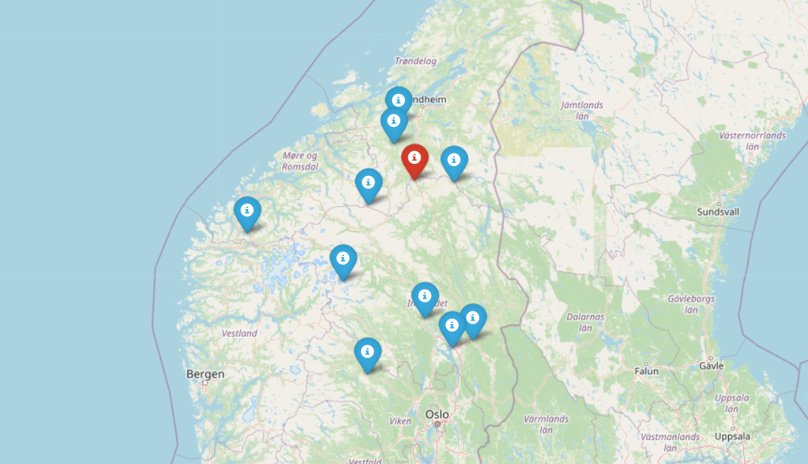

# Film_map

film_map.py is a module to get a map with marked nearby places where films were shot in given year.
You enter location and year. Markers are only in location country.

## Usage
```python
>>> python main.py()
Please enter a year you would like to have a map for: 2010
Please enter latitude: 62.658729
Please enter longitude: 10.204164
Map is generating...
Please wait...
Map is generated successfully. Open Film_map.html in browser
```


## License
[MIT](https://choosealicense.com/licenses/mit/)